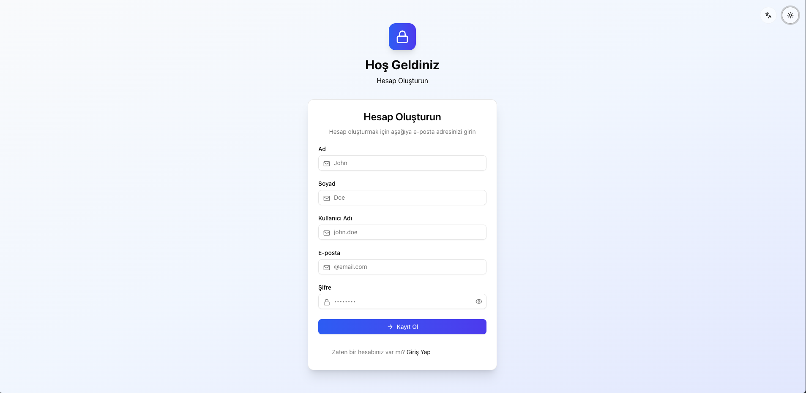

[empty file]
# MeskChat

A modern, full-stack chat application enabling real-time messaging between users using SignalR. The project is fully dockerized for easy local development and deployment.

## Table of Contents

- [Features](#features)
- [Tech Stack](#tech-stack)
- [Architecture](#architecture)
- [Getting Started](#getting-started)
- [Usage](#usage)
- [Project Structure](#project-structure)
- [Contributing](#contributing)
- [License](#license)

---

## Screenshots From Application

<div align="center" style="background: linear-gradient(135deg, #f8fafc 0%, #e0e7ff 100%); padding: 32px 0; border-radius: 24px; box-shadow: 0 8px 32px #0001;">
  <h3>✨ Application Screenshots</h3>
  <div style="display: flex; flex-wrap: wrap; justify-content: center; gap: 32px; margin-top: 24px;">
    <div style="background: #fff; border-radius: 20px; box-shadow: 0 4px 24px #0002; padding: 16px; width: 370px;">
      
      <div style="margin-top:8px; font-weight:500; font-size:1.1em;">🔒 Login (Dark, EN)</div>
    </div>
    <div style="background: #fff; border-radius: 20px; box-shadow: 0 4px 24px #0002; padding: 16px; width: 370px;">
      
      <div style="margin-top:8px; font-weight:500; font-size:1.1em;">📝 Register (Light, TR)</div>
    </div>
    <div style="background: #fff; border-radius: 20px; box-shadow: 0 4px 24px #0002; padding: 16px; width: 760px;">
      
      <div style="margin-top:8px; font-weight:500; font-size:1.1em;">💬 Chat List (Dark, EN)</div>
    </div>
    <div style="background: #fff; border-radius: 20px; box-shadow: 0 4px 24px #0002; padding: 16px; width: 370px;">
      
      <div style="margin-top:8px; font-weight:500; font-size:1.1em;">💬 Chat (Dark, EN)</div>
    </div>
    <div style="background: #fff; border-radius: 20px; box-shadow: 0 4px 24px #0002; padding: 16px; width: 370px;">
      
      <div style="margin-top:8px; font-weight:500; font-size:1.1em;">💬 Chat (Dark/Light, TR/EN)</div>
    </div>
    <div style="background: #fff; border-radius: 20px; box-shadow: 0 4px 24px #0002; padding: 16px; width: 760px;">
      
      <div style="margin-top:8px; font-weight:500; font-size:1.1em;">⚡️ API Reference UI</div>
    </div>
  </div>
</div>

## Features

- Real-time chat between users powered by SignalR
- User authentication (JWT-based)
- User status (online/offline) tracking
- Message read receipts
- Password reset and email notifications
- Modern, responsive UI

---

## Tech Stack

**Backend (API):**
- .NET 9 (C#)
- ASP.NET Core Web API
- SignalR (real-time communication)
- MediatR (CQRS pattern)
- Entity Framework Core (PostgreSQL)
- Autofac (DI)
- FluentValidation
- JWT Authentication
- Docker

**Frontend (Client):**
- React (TypeScript)
- Vite (build tool)
- TanStack Router & React Query
- SignalR JS Client
- Orval (OpenAPI client generation)
- Tailwind CSS (UI styling)
- Docker

**Database:**
- PostgreSQL (Dockerized)

---

## Architecture

- **MeskChatApplication**: Contains all backend logic, including API endpoints, SignalR hub, authentication, user and message management, and database migrations.
- **MeskChatClient**: Frontend React app for user interaction, chat UI, authentication, and real-time updates.
- **docker-compose.yml**: Orchestrates the API, client, and database containers for seamless local development.

### SignalR Flow

- Users connect to the SignalR hub (`/chat`) after authentication.
- Messages are sent and received in real-time.
- User status changes (online/offline) are broadcast to other users.
- Read receipts and message events are handled via SignalR.

---

## Getting Started

### Prerequisites

- Docker & Docker Compose installed

### Local Development

1. **Clone the repository:**
	```bash
	git clone https://github.com/knetic0/mesk-chat-application.git
	cd mesk-chat-application
	```

2. **Start all services with Docker Compose:**
	```bash
	docker-compose up --build
	```

	- The client will be available at [http://localhost:3000](http://localhost:3000)
	- The API will be available at [http://localhost:5254](http://localhost:5254)
	- PostgreSQL runs on port `5432`

3. **Access the application:**
	- Open your browser and navigate to [http://localhost:3000](http://localhost:3000)
	- Register a new user and start chatting!

---

## Usage

- **Register/Login:** Create an account or log in.
- **Chat:** Select a user and start a real-time conversation.
- **Status:** See online/offline status of users.
- **Password Reset:** Use the forgot password feature to reset your password via email.

---

## Project Structure

```
MeskChatApplication/   # Backend (.NET, SignalR, API)
MeskChatClient/        # Frontend (React, SignalR JS)
docker-compose.yml     # Docker orchestration
```

---

## Contributing

Contributions are welcome! Please open issues or submit pull requests for improvements or bug fixes.

---

## License

This project is licensed under the MIT License.

---

**Docker Notes:**
- All environment variables (e.g., database connection) are pre-configured for local development.
- Data is persisted in a Docker volume (`db_data`).
- For production, update secrets and environment variables accordingly.

---
